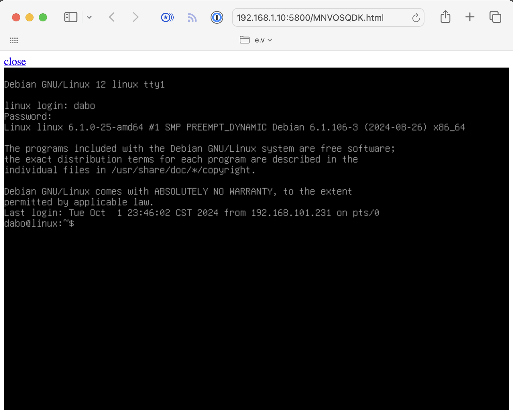

# susi - a Simple User Interface for QEMU

This program is a QEMU management software that simplifies the operation and control of QEMU instances. It provides a user-friendly interface for managing virtual machines, offering a range of features to enhance your virtualization experience. It was mostly written to explore the QMP protocol of QEMU.

## Features

- **Simple VM Management**: Easily start and stop QEMU instances with intuitive controls.
- **USB Passthrough**: Seamlessly use USB devices in your virtual machines.
- **SSH Access**: Securely connect to your VMs using SSH.
- **VNC Access**: Remote graphical access to your virtual machines via web.

## Getting Started

To get started with this software, you need to follow these steps:

1. Install QEMU:
   Ensure you have QEMU version 9 or higher installed on your system. You can check your QEMU version with:

   ```sh
   qemu-system-x86_64 --version
   ```

   If you need to update or install QEMU, please refer to your operating system's package manager or the [official QEMU website](https://www.qemu.org/download/).

2. Install susi via Rubygems:
   You can install the susi-qemu gem using the following command:

   ```sh
   gem install susi-qemu
   ```

   This will install the necessary Ruby libraries to run the software

Make sure both QEMU (v9+) and the susi-qemu gem are properly installed before proceeding to use the software.

## Usage

Here's how to use susi:

1. Initialize a project:
   Navigate to your project directory and run:

   ```sh
   susi init
   ```

   This creates a `.susi.yml` configuration file in your project directory.

2. Start a VM:
   Once you have a `.susi.yml` file, you can start a VM with:

   ```sh
   susi start
   ```

   This command uses the default QCOW2 image located at `~/.susi/templates/default.qcow2`.

### Port forwarding

Add `forward_ports` (or `ports`) to `.susi.yml` to expose guest ports on `0.0.0.0` of the host via QEMU `hostfwd`:

```yaml
forward_ports:
  - 3000           # host 3000 -> guest 3000
```

Only TCP is supported; SSH (guest 22) is forwarded automatically and does not need to be listed.

Note: susi reserves and binds local host ports in these ranges for its own control services:
- QMP: 4000–4099
- SSH: 2000–2099
- VNC web: 5800–5899
- VNC: 5900–5999

3. Access the VM:
   - Via SSH: `susi ssh`
   - Via VNC: `susi vnc`

4. Stop the VM:
   To stop a running VM, use the following command:

   ```sh
   susi stop <vm_name>
   ```

5. List running VMs:
   To list all running VMs, use the following command:

   ```sh
   susi ls
   ```

Note: The standard susi config expects a default QCOW2 image at `~/.susi/templates/DEFAULT.qcow2`. Ensure this image exists before starting a VM. You can create or copy a suitable QCOW2 image to this location.

## VNC Access Example

To access a VM via VNC over the web, use the following command:

```sh
$ susi vnc
[2024-10-01 23:34:12 +0800] VNC screen: http://192.168.1.10:5800/MNVOSQDK.html
[2024-10-01 23:34:16 +0800] Access by: 192.168.1.11
```



## SSH Access Example

To access a VM via SSH, use the following command:

```sh
$ susi ssh
Linux linux 6.1.0-25-amd64 #1 SMP PREEMPT_DYNAMIC Debian 6.1.106-3 (2024-08-26) x86_64

The programs included with the Debian GNU/Linux system are free software;
the exact distribution terms for each program are described in the
individual files in /usr/share/doc/*/copyright.

Debian GNU/Linux comes with ABSOLUTELY NO WARRANTY, to the extent
permitted by applicable law.
Last login: Tue Oct  1 23:21:05 2024 from 192.168.101.231
dabo@linux:~$ 
```

## Remark

You probably don't want to use this software. If you want to do something similar,
consider using [Vagrant](https://www.vagrantup.com/) instead.

## License

See [LICENSE](LICENSE) file
